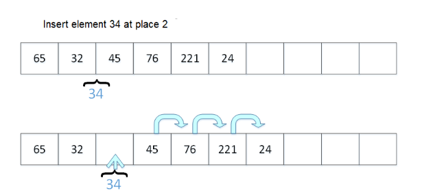
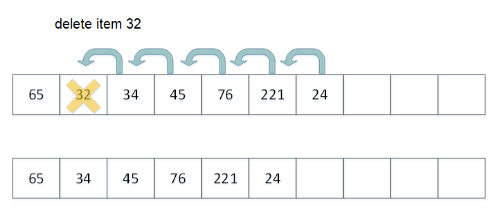

# ArrayList

## Collection

It is a collection and implements the List interface. ArrayList -> List -> Collection -> Iterable

## Memory

Uses an array memory structure, with tightly packed elements. You can always access an nth element in the list, by calculating its position based on where the array starts.

If the array where items are stored becomes too small, ArrayList automatically copies all of it to a larger array.

## Decalaration

Without determinate length:

```java
ArrayList<Integer> intArray;
ArrayList<Double> doubleArray;
ArrayList<Char> charArray;
ArrayList<String> stringArray;
```

With initialization

```java
ArrayList<Integer> intArray = new ArrayList<Integer>();
```

With initial length

```java
ArrayList<Integer> intArray = new ArrayList<Integer>(20);
```

## Constructor

Collection classes have multiple constructors:

- empty
- with collection as argument
- with an initial length

## List

This is an ordered collection. The most important access methods are `add()`, `get()` and `remove()`.

- get(index) return item at index
- set(index, element) replaces item at index with element
- add(index, element) inserts element at index
- remove(index) deletes item at index
- indexOf(object) returns index of first occurrence of object
- lastIndexOf(object) return index of last occurrence of object

### Add

Whenever we add() to a List, things have to move and make space:



### Delete

When we remove, since it's "tightly packed", there are no gaps allowed. Hence, we need to move all items:



## Capacity

At the beginning, an ArrayList is 10 places long. As soon as these are used up, a larger space is allocated in memory and array is copied. This new array is normally 1.5x the size of the last (15 -> 22 -> 33 -> 49...).

If the desired array size is clear in the beginning, it's good to specify it since it avoids copying the array.

## Array for loop

```java
// fill out the array
List<Double> doubleArray = new ArrayList<>();
for (int i = 1; i <= 10; i++) {
    doubleArray.add(1.0/i);
}
// print out the numbers
for (int i = 0; i < 10; i++){
    System.out.printf(" %.3f", doubleArray.get(i));
}
```

Output: `1.00 0.500 0.333 0.250 0.200 0.167 0.143 0.125 0.111 0.100`

## Iterate through all values

for-each loop:

```java
for (int num : doubleArray){
    System.out.printf(" %f", num);
}
```

This for-each loop has **read only** access, meaning it can't change any values.

## Utility methods

```java
// maximum value of doubleArray
double max = Collections.max(doubleArray);
// minimum value of doubleArray
double min = Collections.min(doubleArray);
// reverse array
doubleArray = Collections.reverse(doubleArray);
// replace all occurrences of 17.5 with 1.0
Collections.replaceAll(doubleArray, 17.5, 1.0);
// swap elements for positions 2 and 5
Collections.swap(doubleArray, 2, 5);
// sort array
Collections.sort(doubleArray);
```
