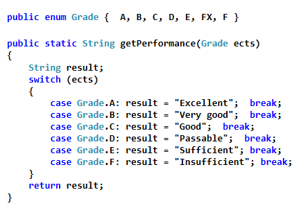
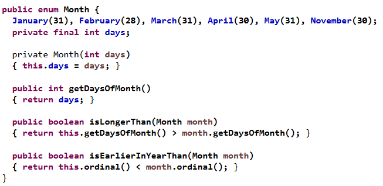
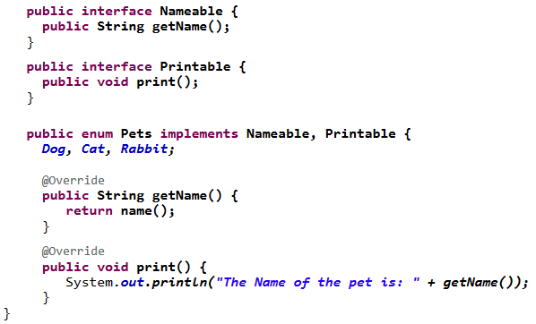

# Enum(erator)

## Definition

It provides an efficient way to create a set of named constants. They keyword to define one is `enum`.

Example: Define a variable day of the week. Since there are only seven meaningful values, create an enum from it.

```java
public enum Weekday {
    Sunday, Monday, Tuesday,
    Wednesday, Thursday, Friday, Saturday
}
```

## Advantages

- It sets clear values for a variable
- Misallocations  are avoided, since only valid days of the week can be used
- The IDE supports enums.

## States as enum

Imagine an object can only have a finite amount of states. This is a good moment to create an enum.

```java
public enum State {
    acquired, available, leased, damaged, underProgress
}
```

## Decisions

You can use enums to make decisions based on an enum easier:



## Fields and methods in enums

Enums can have attributes if you wish. These are final and require a private constructor.



## Interfaces

Just like common classes, enums can implement interfaces.


