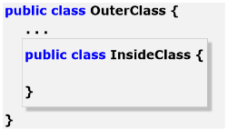
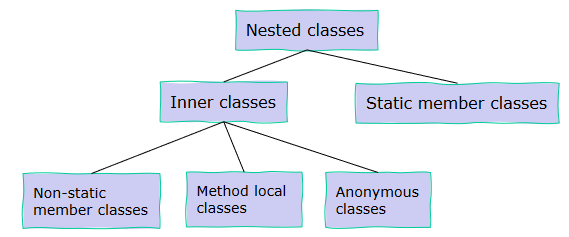
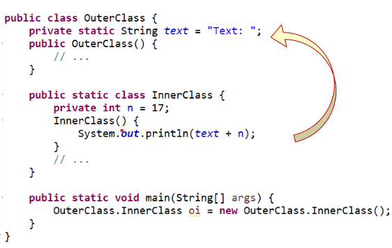
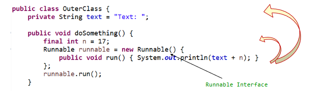

# Inner Classes

## Definition

Inner Classes are declared within the scope of another enclosing (top-level) class. They don't have their own `*.java` file and are used for local type declarations, not requiring greater visibility.

## Types

- Inner classes: classes defined within other classes
- Nested classes: static top-level classes defined within other classes
- local classes: defined within a method
- anonymous classes: local, nameless classes defined in a method.

### Types of nested classes

Either non-static inner classes or static member classes.

### Inner Classes in Detail

These are *real (or local)* inner classes, but not (directly) visible from the outside. They receive the name of the parent class, supplemented by their own name, divided by `$`: `OuterClass$InnerClass.class`.

### Element Classes

The inner class has access to all attributes of the OuterClass.

### Static Nested Classes

Nested classes are top-level and behave like *normal* classes. Their name is supplemented by the name of the OuterClass: `OuterClass.InnerClass`.

### Local classes

Are defined within an OuterClass method. They also have access to the attributes of the OuterClass.

Though, static attributes are not allowed and they can only access final variables of the surrounding method.

## Anonymous classes

They work similarly to local classes and have the same restrictions. The difference is, that they don't have a name or a constructor.

