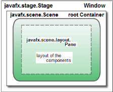
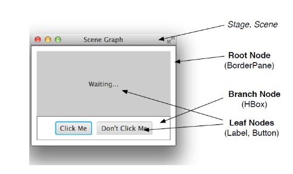
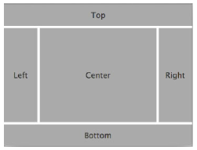

# Java FX Intro

## Development

JavaFX was Java's response to HTML5. It works as a cross-platform framework for internet applications, that can be used on mobile, PCs and more. Since Oracle seems pretty keen on mobile and web, they're probably going to stop development of JavaFX pretty soon.

## The lifecycle

The base class is **javafx.application.Application**. 
The lifecycle goes like this:

- Create an instance of application
- run the init() method
- run the start() method
- wait for the application tp exit(by calling exit(), for example)
- run the stop() method

## Scene Graph API

Makes it easy to create graphical interfaces with complex visual effects. The Scene Graph manages an internal model of all visible objects. At any point, the background calculates objects to be displayed, areas to be redrawn and rendered efficiently.

## JavaFX scene graph

**Stage**: native window on screen, contains **scene**
**Scene:**: contains **scene graph**
**Scene graph**: contains layout (panes) and controls (buttons and so on)

GUI Structure: 

It uses a **tree structure** with each node having zero, one or more children. Nodes that *do not* have children are **leaves**. Labels, buttons and text fields can also have children.

Here's an example of the structure:

## Node

The node is the base class of all visible objects in Scene graph. It is either a leaf node (no children) of a branch node (derived from parent).

## Branch node

Branch nodes are designed to contain other visible objects (containers).

## Java FX controls

These are part of the interface that the user interacts with. They can come in different forms, like:

- labels
- progress bar
- text field
- text area
- button
- menu item
- checkbox
- choice box
- radio button
- and many more

### Label

Used to show text outputs on the screen. They can contain texts and images.

### Button

Used to trigger events and have text or icons to explain their action.
Toggle buttons have a state (on/off). Buttons can also have a tooltip as help text.

### Check box / Radio button

Are used to select on or more options. To ensure that only can option can be selected when wished so, the buttons are grouped together. These can also show tooltips.

### Text input fields

There is a distinction between single line (text field) and multi line (text area). A password field hides the entered text.

### Menu, Menu bar, Menu item

Any JavaFX app can have any number of menu bars. One of those can be set as "system menu bar". It will appear at the location where the system would normally display menu bars (system dependant).

## Layout panes

To arrange controls in the GUI, you use Layout Panes. There are some predefined ones:

- GridPane
- FlowPane
- HBox
- VBox
- BorderPane
- AnchorPane
- TilePane
- StackPane

The dimension of a node is calculated by its content. There are properties like min/pref/max Width and min/pref/max Height that can influence the size. Different panes process specific dimensions differently.

### Border pane

It creates a large central area (center) that expands horizontally and vertically. The four edge areas increase horizontally or vertically. You usually put the menu in the top area.

### HBox

Creates an horizontal box and places all children side by side.

### VBox

Creates a vertical box and places all children on top of each other.

### Tile pane

Defines a grid of cells. Each cell has the same height and width. They take the size of the largest content.

### Grid pane

Is suitable for complex arrangements and is also based on rows and columns. The difference is, that it resizes cells dynamically depending on the content. Some cells can be empty. Also, nodes can fill multiple cells.

### Scroll pane

It only displays part of a pane. The user can then scroll to see the part of the pane they want.
