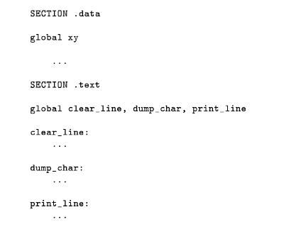
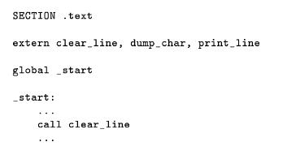
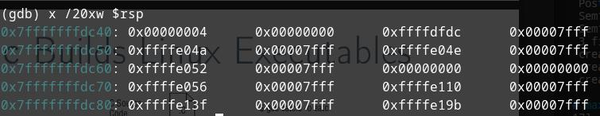

# Procedures

Reason for it: programs get **big** and it's hard to keep an overview of everything. It's also necessary to have little sections that you can test. These are **procedures** and they have inputs and outputs.

What are they really?

A part of the code, intended to be called from somewhere else and that returns to the calling code after running.

So what's different to jumps?

Jumps don't have a direct return mechanism and jumps remain inside a procedure.

## Calling

1. `call` pushes the return adress (which we're going to return to) on the stack.
2. then transfers to the execution adress
3. when finished, the procedure returns with the instruction `ret` and pops the return adress from the stack.

Can you use `call` from inside a procedure? YES!:
Inside a procedure, all instructions are allowed.

## Recursion

## Program Data

## Saving on registers

## Calling conventions (ABI)

When using foreign code, reigster usage must be agreed, like with external libraries.

ABI: Application Binary Interface

- Depend on CPU Architecture, OS, even programming language.

Caller- vs callee-saved

- Caller-saved (volatile) registers: caller has to save register before call
- Callee-saved (non-volatile) registers: procedure has to save register.

## Little hack: Constant Data

Store "local" data within the `.text` section.

- Instructions are just data
- can be adressed using label
- Advantage: read-only, not separated from procedure definition
- Disadvantage: Read-only, is bad style.

## Local Labels

When programs get large, you require more and more labels. But these must be **unique**.

Solution? Local labels!

- Names start with a period (.)
- only referrable below corresponding global label
- could be accessed globally by concat (`clearline.loop`)

## Jumps: short, near and far

If you get the error "short jump is out of range", it means the jump destination is too far. Solution: change `jmp` to  `jmp near`.

Types of jump:

- short: within 127 bytes of jump instruction
- near: inside the same code segment
- far: anywhere else

## Libraries

Isues with big, monolothic programs:

- hard to maintain
- error prone

- same code, repeated
- not efficient

What is a library? Collection of procedures and data, just like another piece of code. These are assembled and maintained independently.

### Creating libraries

It's in a separate file. It contains the procedure definition(s). Any procedures to be used outside are dfined as `global`.

How to use these?

- declare as `extern`
- then use them like local procedures
- const and var can also be declared `extern`

Create

Call

Assembling it now requires to include the library file

## Command Line Arguments

Running a program with arguments in the shell: arguments are separated with spaces:
    `./myprogram arg1 arg2 ... argN`

Why do we care?:
Becase the stack is initialized with:

- Count of arguments
- Adresses of arguments
- Adresses of environment variables
- Aditional OS data
- Effective arguments and environment data

RSP points to the top of the stack.

Count arguments: num >= 1

Adresses of arguments: point to string data of arguments passed to the exectuable. The first is the invocation text: path and name of exectuable invoked. This is terminated by a 64-bit "null pointer" (8 bytes of 0)

Example `showargs aaa bbb ccc`
