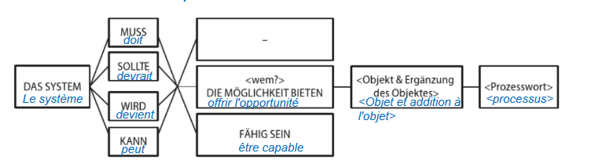
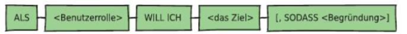
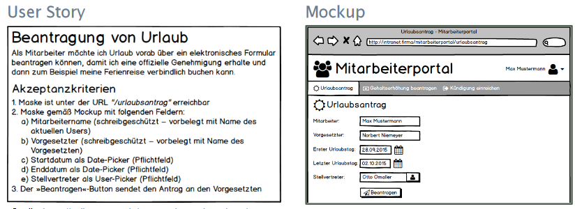

# Anforderungen Dokumentieren

## Natürlich Sprachlich

Die wichtigsten Problemen dabei:

1. Unvollständig beschrieben
2. Unspezifische Substantive
3. Unvollständig spezifizierte Bedingungen
4. Unvollständige Vergleiche
5. Universalquantoren
6. Nominalisierung

## Unvollständig beschrieben

"Übertragen Sie die Daten von die Entwicklungs- in die Produktionsumgebung"

- Weche Daten genau?

Typische Fragen: Was, von wo, wohin?

Tipp:

1. Passiv-Formulierungen vermeiden: "Zur Anmeldung des Benutzers werden die Login-Daten eingegeben"
   1. Wer gibt die Daten ein, wo gibt er sie ein, usw...
   2. Aktive Formulierung: "Das System soll dem Benutzer ermöglichen, seinen User-Namen und sein Passwort über die Tastatur am Terminal einzugeben"

## Unspezifische Substantive

"Die Daten sollen dem Benutzer auf dem Terminal angezeigt werden"

- Welche Daten, welcher Benutzer, auf welchen Terminal?

Besser: "Das System soll dem registrierten Benutzer seine Rechnungsdaten auf dem Terminal, an dem er angemeldet ist, anzeigen"

## Unvollständig spezifizierte Bedingungen

Tipps:

1. bei komplexen Strukturen eine Entscheidungstabelle zur Erkennung nicht beschriebener Varianten einsetzen
2. Signalwörter für Bedingungen: "wenn...dann", "im Falle von", "abhängig von", usw.

Beispiel: "Das Restaurantsystem soll einem registrierten Gast bei einem Alter von über 17 Jahren alle im Lokal angebotenen Getränke anzeigen."

Fragen: Was, wenn er unter 17 ist, welche Getränke werden angezeigt, usw.

Besser:
Das Restaurantsystem soll einem registrierten Gast:

- Bei einem Alter von unter 16 Jahren ausschliesslich alkoholfreie Getränke anzeigen
- Bei einem Alter von 16-17 Jahren alkoholfreie und alkoholische Getränke ohne
Branntwein anzeigen
- Bei einem Alter von über 17 Jahren alle im Lokal angebotenen Getränke anzeigen

## Unvollständige Vergleiche

Problem: Adjektive sind nicht richtig spezifiziert.

„Die Daten sollen dem Benutzer schnell angezeigt werden."

Was heisst schnell?

Besser: "Das System soll die Daten sollen dem Benutzer innerhalb von max. 2 Sekunden anzeigen.."

## Universalquantoren

Problem: Mengen und Häufigkeiten sind unpräzise

Beispel: "Das System soll in jedem Untermenü alle Datensätze anzeigen."

Sicher in jedem Untermenü und tatsächlich alle Daten?

Tipp: auf Wörter wie *nie, immer, kein, jeder, alle, irgendeiner, nichts* schauen.

## Nominalisierung

Problem: Durch Nominalisierung wird ein längerer Prozess zu ein einziges Ereignis gemacht.

Beispiel: Bei einem Systemabsturz soll ein Neustart des
Systems erfolgen“on "übermitteln" wird "die Übermittlung".

Systemabsturz und Neustart sind Prozesse, die genauer angeschaut werden müssen. Was heisst Systemabsturz und wie ergolgt ein Neustart?

Tipp: Nominalisierungen prüfen, ob sie woanders im Detail erklärt wurden. Wenn nicht, eine weitere Anforderung schreiben.

## Definition Anforderungsdokumentation

Systematisch dargestellte Sammlung von Anforderungen, die vorgegebene Kriterien erfüllt.

Gründe dafür:

- Ist basis für Systementwicklung
- Sind rechtlich relevant
- sind komplex
- sollen Beteiligten zugänglich sein

## Standardisierte Arbeitsergebnisse

### 1. Satzschablone

Definition: Bauplan für Syntaktische Struktur einer Anforderung oder User Story in natürliche Sprache.

Algemeiner Format:

Übung 7: Anforderungen mit Satzschablonen.
a) Das System sollte den Kunden erlauben, Videos von sich selbst hochzuladen.
Das System muss die Möglichkeit bieten PDF-Dokumente hochzuladen und senden.
Das System sollte die Möglichkeit bieten mit der Applikation Physio-Org zu kommunizieren.
Das System sollte die Nöglichkeit bieten die aktuelle IT Infrastruktur weiter zu verwenden.
Das System muss fähig sein den Datenschutz zu gewährleisten.
Das System wird (den Terapeuthen) die Möglichkeit bieten, den Verlauf der Therapie zu verfolgen.

### 2. User Story

Ist von der Sicht des Users und "persönlich". Eine Schablone gibt es dafür auch:

Übung 7: Anforderung mit User Sroty Schablone
b) Als Pazient bei Physio-Org will ich durch die App Videos hochladen können, sodass mein Therapeut mir sagen kann, ob ich meine Übungen richtig duchführe oder nicht.
Als Pazient bei Physio-Org will ich, dass meine Daten geschützt sind, sodass ich mir keine Sorge vor Leaks machen muss.

**Zusammenhang Epic und User Story**: Epics beschreiben eine Anforderung ganz allgemein und abstrakt und nicht unbedingt direkt die Funktion eines Produkts. Diese muss dann in verschiedene User Stories runtergebrochen werden.

Beispiel:

- Epic: Als Anwender möchte ich ein Dokument ausgeben können,
damit ich es archivieren kann.
- User Story 1: Als Anwender möchte ich, dass beim Anklicken des «Druck»-Icons die aktuelle
Dokumentauswahl an den Standarddrucker gesendet wird, damit ich es physisch
archivieren kann.
- User Story 2: Als Anwender möchte ich, dass beim Drücken eines Short-Keys das aktuelle Dokument als
PDF/A ausgegeben wird, so dass ich es elektronisch archivieren kann.

**Zusammenhang Epic und Mockup**:

### 3. Formularvorlage - Use Case

Definiert Anforderungen für **fachlich relevante Ziele** in der Sprache der Anwender, doch alle Szenarien werden gebündelt: sowohl Erfolg wie Misserfolg.

So kann ein Use Case den Kontext für User Stories bilden.

Übung 7:
c) Dokument hochladen und teilen.
Korrekturen an Übungen empfehlen.
Anpassungen an Therapie durchführen.

## Standardisierte Anforderungsdokumentation

Wozu?

Planung, Architekturentwurf, Implementierung, Test, änderungsmanagement, Systemnutzung und -wartung und Vertragsmanagement.

Vorteile

- Einfache Einarbeitung Neuer Kunden/Mitarbeiter
- Schnelle Erfassung ausgewählter Inhalte
- Ermöglicht selektives Lesen/Überprüfen
- Ermöglicht (teilweise) automatische Prüfung der Doku
- Ermöglicht Wiederverwendung

Minimale Inhalte:

- Einleitung: Zweck und Grupe, Systemunfang, Stakeholder, Definitionen, Referenzen und Übersicht des Docs.
- Allgemeine Übersicht: Systemumfeld, Architekrutbeschreibung, Systemfunktionalität, Nutzer- und Zielgruppen, Randbedingungen, Annahmen
- Anforderungen
- (Anhang und Index)

Qualitätskriterien:

- Eindeutig und Konsistent
- Klare Struktur
- Modifizierbar und erweiterbar
- Vollständig
- Verfolgbar (Traceability)

