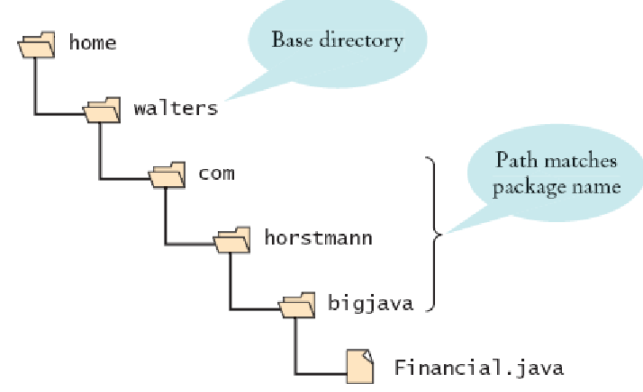

# Modules

## Packages (recap)

A package is a set of related classes. Some important packages are:

- java.lang
- java.util
- java.io
- java.time
- java.net
- java.sql
- java.awt

The point of using packages is to group classes into larger, reusable units.

**Directory tree and package name must match**:



### Visibility

Classes and interfaces that belong to the API are `public`. Methods that belong to the API are also `public`. But, those belonging to the implementation are private or package-private.


## JAR - Java Archive Files

Can contain classes and other files like images and sounds. These are compressed using zip and can be an executable. They can be included into a project via the **class path**.

## Modules (detail)

A module is a container for Java packages. These packages can be exported by the module to be read somewhere else and they can also require other modules to run.

**Modularization:** allows:

- smaller application images
- encapsulation of internal packages
- start-up detection of missing modules


## Descriptor

Each module has a descriptor, which declares the following:

- exported packages
- required modules (java.base always there)
- transitively required modules (may be read by client modules)
- packages opened to dedicated client modules

It has the name: **module-info.java** and is compiled. Example:

```java
module ch.bfh.p2.base {
    export ch.bfh.p2.base
    requires java.logging
}
```

## Names and Structures

modules are named the same way as packages and the descriptor is located in a directory with the same name as the module. This directory has the other hierarchy.

## Modules in projects

Normally there is **one module** per project. The required modules must be included in the module path.

## Packaging

Modules can be packeted into JAR files (with the rules from above) or into a new file format: JMOD. This JMOD is like a JAR file (zipped) and has the advantage of having "jlink" to assemble modules automatically.