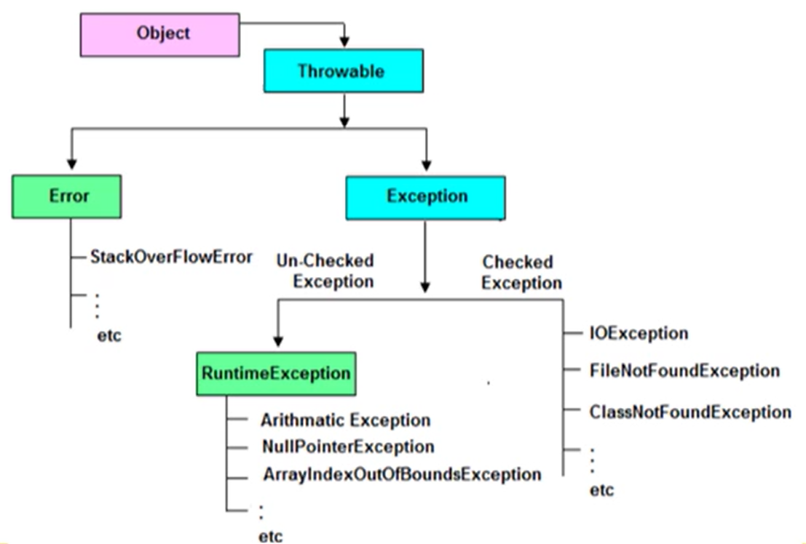
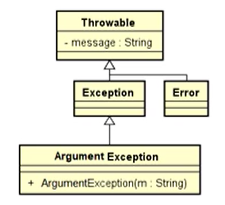

# Exceptions

## What are they

Errors that occur during runtime are carried over `Exceptions`. These can be system, user input or runtime errors.

## Errors as it used to be

Not all languages offer Exeption handling. There used to be a lot more who didn't. The way those languages managed exceptions was:

- error codes, like -1 o 1
- returning true/false
- returning an object or null

The problem with this is: what if the returned value is the expected one, or if the program can't, for some reason, return a value?

## As it happens

When an Exception is thrown, it is forwarded up the call stack until an error handling procedure is found for that Exception (`catch` statement in the code). Exceptions that don't get intercepted cause the program to stop and print a message to the console.

## Exception Handling

Exceptions Handling is the conversion of system errors into useful error handling. It is a feature of Java to maintain the flow of an application. If a runtime error does occur, the JVM throws a system exception and generates an error message (these messages are not commonly useful...). It is always preferred to handle the Exception before it stops the program, and to write a useful message for it.

## java.lang.Exception

All runtime Exceptions are represented by Exception classes. All of these are derived from `java.lang.Exception`.

Exceptions are thrown with the keyword `throw`, like the following:

```java
throw new java.lang.Exception();
// or
throw new java.lang.IllegalArgumentException();
```

## Catch obligation

There are some Exceptions, like `FileNotFoundException` and `IOException` which **have** to be caught. But, some like `NumberFormatException` and `ArrayIndexOutOfBoundsException` don't have to be.

*But how are they different?*

It comes from this hierarchy:



The **Un-Checked Exceptions** are not checked by the compiler. On the other hand, Checked-Exceptions are, and hence have to be declared or handled.

## Generating Exceptions

Here's an example of how to do it:

```java
public static void output(String str) {
    System.out.printf("Before test: input %s %n", str);

    if (str.length() < 3)
        throw new IllegalArgumentException();
    
    System.out.printf("After the test input %s %n%n", str);
}
```

Here we will have and exception, if the text is not long enough. The problem is though, that if the Exception is thrown, the program stops. This should be avoided:

Handle the exception with a `try catch` block:

```java
public static void output(String str) {
    try {
        System.out.printf("Before test: input %s %n", str);

        if (str.length() < 3)
            throw new IllegalArgumentException();
        
        System.out.printf("After the test input %s %n%n", str);

    } catch (IllegalArgumentException e) {
        System.out.println("The input string is too short: " + str)
    }
}
```

Now the program will just print to the console and continue running instead of stopping.

## Own Exceptions

It is possible to implement your own Exceptions by extending the Exception class:

```java
public class ArgumentException extends Exception {
    public ArgumentException(String message) {
        super("Invalid argument: " + message);
    }
}
```

This, because the Exception class looks as follows:



An example of using this Exception:

```java
public int calculate(int[] v) throws ArgumentException {
    if (v.length < 5)
        throw new ArgumentException("Input length must be at least 5.");
    int res = 0;
    for (int i = 0; i < 5; i++)
        res = res + v[i];
    return res;
}
```

Now, if you were to catch this new exception:

```java
public static void main(String[] args) {
    int res = 0;
    int[] vector = { 3, 4, 5, 6 };
    try {
        res = calculate(vector);
    } catch (ArgumentException e) {
        e.printStackTrace();
    }
    System.out.println("Result: " + res);
}
```

## Overloading Exceptions

Say you catch your `ArgumentException`, but it was due to another Exception. How would you know? Well, you can create the `ArgumentException` with multiple constructors, allowing for different scenarios:

```java
public class ArgumentException extend Exception {
    public ArgumentException() {
        super();
    }

    public ArgumentException(String message) {
        super("Invalid argument: " + message)
    }

    public ArgumentException(Exception cause) {
        super(cause);
    }
}
```

## Multicatch

It is also possible to catch multiple exceptions at once: `catch (NumberFormatException | ArithmeticException | ArrayIndexOutOfBoundsException e) ...`

## try - finally

Code in the `finally` block will get executed, **whether an Exception was thrown or not**. It normally helps to:

- finish process cleanly
- free up resources (variables to null), closing streams or files
- print out local info

## Assertions

Assertions are a method to make sure certain pre and post-conditions are met. If an assertion is not fulfilled, a runtime error occurs. **The JVM ignores assertions, as longs as they are not turned on**.

Example:

```java
public class Triangle extends Polygon {
    public Triangle(Point[] s) {
        super(s);
        assert s.length == 3; // this could throw exception
    }
}
```

We can also add a message:

```java
public class Triangle extends Polygon {
    public Triangle(Point[] s) {
        super(s);
        assert s.length == 3 : "Triangle constructor requests 3 points";
    }
}
```
