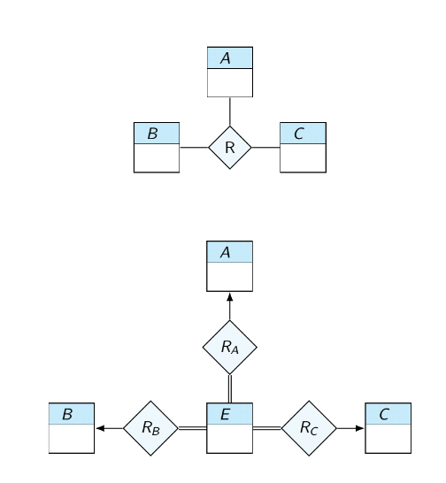
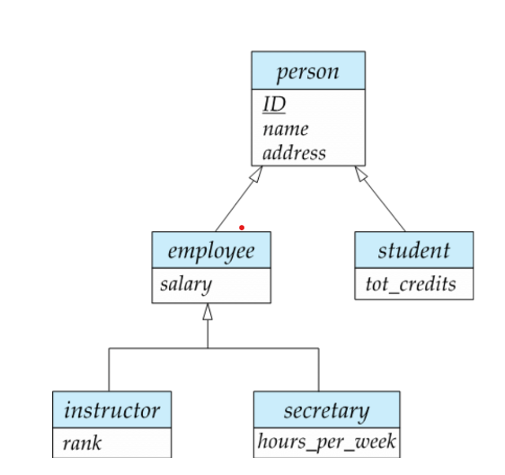

# Entity Relationship Model

It models some part od the world as entities and the relationships between them

## Entity Set

Something uniquely identified by its attribute values

- person: name, profession, address
- company: name, address

This is then grouped into groups with same attributes

## Relationship Set

The "connections" between entities. It is a **tuple**.

A relationship set has descriptive attributes, like *date* at with a teacher started advising a student.
Since a relationship is a tuple, entities cannot be in the same relationship multiple times!

### Degree

The number of entity sets that participate in a relationship is called the **degree** of the relationship.
Most of these are **binary**.

### Cardinality and Participation

Types of cardinality:

- one to one
- one to many
- many to one
- many to many

entities are allowed to no participate in relationships. If this is the case, the participation is |**partial**, otherwise it's **total**, if they all have to participate.

Cardinality is displayed with *arrows*. If the arrow has a head, then it means ONE. If not, it means MANY.

Participation is displayed with *double lines*. A double line means it is total, otherwise just partial.

## ER Diagrams

instructor (ID, name, salary) ----- < advisor > ----- student(ID, name, tot_cred)

Here, *advisor* is the relationship set.

The main goal: to make a DB Schema! 

### Translating Relationship Sets

Setting primary key:

- many to many: both entity primary keys are primary key
- one to many: choose the attribute that appears only once
- one to one: can choose either, both identify the set

### Total to one relationship

instructor ===== < advisor > -----> (student)

this means, that each instructor HAS to take at least one student, so it's kinda like a function.

instructor <===== < advisor > =====> (student)

this means, that each instructor has to take one student and each student has to have an instructor.

## Design Issues

Do I model something as a relationship or an entity? Sometimes, one is better than the other. We have to remember the goal: to create a DB Schema.

## More Attribute Types

Same attributes form the relational model exist in the ER model. These are called "*simple and single-valued attributes*". But there are more:

- **name** is a composite attribute (first, middle, last)
- **phone number** is multivalued attribute (they can have many)
- **age()** is a derived attribute (function)

Translated to a schema it would be: `instructor(ID, name_first, name_middle, name_last, date_of_birth)`

### Translating multivalued attributes

A composite attribute, like instructor(<ins>ID</ins>, {phone_number}) gets separated into a separate schema:

instructor(<ins>ID</ins>)
instructor_phone_number(<ins>ID, phone_number</ins>)
ID --> instructor

### Another case

What if we had time_slot(<ins>time_slot_id</ins> {day,start_time,end_time})?

Well, that would give:

time_slot(<ins>time_slot_id</ins>)
time_slot_dse(<ins>time_slot_id,day,start_time,end_time</ins>)
time_slot_id --> time_slot

## Non-Binary Relationships

A ternary relationship occurs, when we have 3 entities that make up a relationship. These are uncommon, but possible. **Note: it is not possible to correctly interpret a ternary relationship with two binary ones**

### Cardinality constraints

It is possible to use cardinality constraints (one-to-one, many-to-many, etc) on ternary relationships, **but it's limited to one per relationship**.

Some relationships can have multiple, but this only servers a "different meaning" purpose.  

### Converting to binary form

As stated above, it's not possible to translate a ternary relationship with two binary ones. But, **it's possible to translate it to an additional entity and three binary relationships**.

## Weak entities

These are entities, that are not identifiable by themselves, but are identifiable when in a relationship. Example: child(name, age) ===== <child_inst> ----> instructor (<ins>ID</ins>, name, salary).

Child is not identifiable by itself, but when connected to instructor (and its ID) it is. Hence, we don't need something like a *child_id*.

## Specialization

Some entities are a special kind of another entity. For example, picture the following:

Here, the special entity inherits all attributes and relationships of the parent entity.
**Note: entities can belong to several entity sets: person can be employee AND student**.

### Disjointness

Entities and specializations can be defined as disjoint or total. If a parent is disjoint, it means that it belong to **at most** one special entity. If it is total, it belong to **at least** one special entity. It can also be disjoint and total, meaning it belong to **exactly** one of the specials.

**[FINISH WRITING DOWN THIS SECTION (SLIDES 22 - 32)]**.

