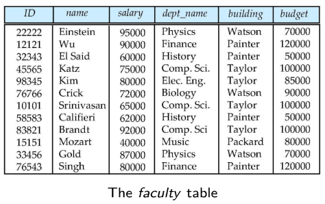
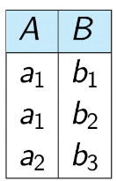

o# Normal Forms

## Wide Tables vs Narrow Tables

What's better, a wide table

or two narrow tables

Sure, one has all the data in one place, but it also has a lot of information redundancy!

## Normal Form types

A normal form is a set of conditions that a DB schema must fulfill. They are classified by how much redundancy they permit. Some names are:

- 1NF
- 2NF
- 3NF
- BCNF
- 4NF

## First Normal Form 1NF

It has Atomic Domains. This means, that the values are **indivisible units**, like "Adam" or "Ashe". If we have a value "Adam Ashe", it's ok as long as we don't divide it. Non-atomicity are usually bad, because they lead to encoding information in the application and not in the database.

Examples of possible problems:

- "John Adams"
- "56 West End Avenue"
- "1010, 3456, 9999"

But 1NF is not enough! We'll see why later

### Recognize Redundancy

No redundancy:

- instructor (**ID**, name, dept_name, salary)
- department(**dept_name**, building, budget)

Redundancy:

- faculty(**ID**, name, salary, dept_name, building, budget)

Questions: 1. can data appear multiple times in the same table? 2. Do any attributes depend on each other?

### Functional dependencies

What we just saw is called functional dependency. It's defined as: a relation r satisfies functional dependency a --> b for any two tuples t1 and t2 of r if t1 and t2 have tha same value for each attribute in a, then they'll have the same value for each attribute in b.

Look at the following example:

B --> A is satisfied, since each b has a value in a, but A --> B is not, since a1 has two values in B.

### Trivial Functional Dependencies

A func. dep. a --> b is called trivial, when a contains b or vice versa. (building --> building)

### Sets of Functional Dependencies

Mostly, sets of func. dependencies are what we're after, which apply on multiples.

### Inferring Functional Dependencies

Some are implicit in others, like: A --> B, B --> C = A --> C

### Closure

Means making implicit dependencies explicit. Definition: the set of all functional dependencies implied by F is called *closure of F* and noted as F+.

Example: {A --> B}+ = {A --> A, A --> B, A --> AB, B --> B, AB --> A, AB --> B, AB --> AB} 

### Equivalence of Functional Dependencies

If F and G are sets of functional dependencies, we say that:

- F implies G iff F implies each functional dependency in G
- F is equivalent to G iff F implies G and G implies F

## Boyce-Codd Normal Form

Definition: a relationship schema R is in BCNF for a set F of functional dependencies if for all non-trivial functional dependencies in F+ of the form a --> b, where a E of R, b E of R, a is a superkey for R.

Or:  a set of relationships is in BCNF for F if each member of it is in BCNF for F.