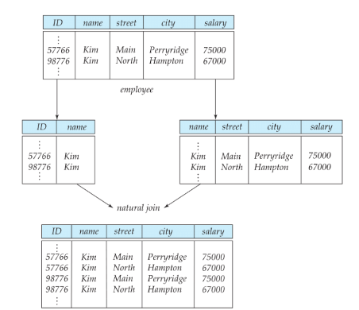
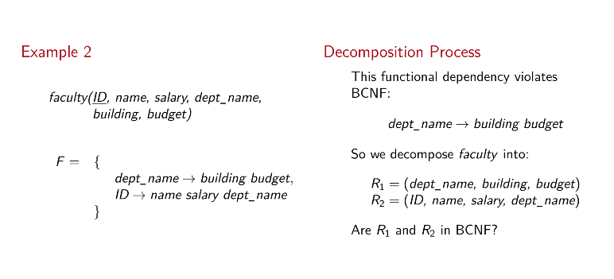

# Normal Forms 2

## Schema decomposition

Normal forms help to know when a schema is good, but not what to do if it isn't. A way to solve this is decomposing it. Decomposing a schema might make it be in the desired form. **Be careful! There are wrong ways to decompose a schema.**

### Lossy Decomposition

Suppose we decompose *employee(ID, name, street, city, salary)* into *employee1(ID, name), employee2(name, street, city, salary)*. **We are losing data here!** That's why it's called "lossy".



### Lossless Decomposition

It's defined as decomposition, if all legal relations r on R are still present, when fully joining the decomposed schemas. A decomposition of R into R1 and R2 is lossless, if at least one of the two hold:

- R1 intersect R2 --> R1, or
- R1 intersect R2 --> R2

An example would be:

let R = (A, B, C) and F = {A --> B, B --> C}. Following decompositions are given:

R1      R2
<br>
(A,B)   (B,C)   lossless: R1 intersect R2 --> R2 (a)
<br>
(A,B)   (A,C)   lossless: R1 intersect R2 --> R1 (b)
<br>
(A,C)   (B,C)   lossy: neither (a) or (b)

## Computing the Closure

(Reminder: closure is the full set of attributes that can be determined from a known set of attributes.)

To determine whether a schema is in BCNF in respect to F (functional dependencies), we need to calculate the Closure of F: F+.

What could the algorithm look like?

```md
For each functional dependency f on schema R
If f holds in all relations on R in which F holds: result := result union {f}
```

## Armstrong's Axioms

- Reflexivity: ab --> b (ab: shorthand a union b)
- Augmentation: if a --> b then ya --> yb
- Transitivity: if a --> b and b --> y then a --> y

Example using these axioms:

F = {A --> B, A --> C, CG --> H, CG --> I, B --> H} (1 to 5)

Then:

- A --> H (transitivity on 1 and 5)
- AG --> I (augment 2 with G and transitivity to 4)
- CG --> HI (**how?**)


**These Axioms are sound and complete**:

1. A set of rules is *sound* if for each set of functional dependencies F they **only** create functional dependencies implied by F.
2. A set of rules is *complete* if for each set of functional dependencies F they create **all** functional dependencies implied by F.

## More Axioms

- Union: if a --> b and a --> y then a --> by
- Decomposition: if a --> by then a --> b and a --> y
- Pseudotransitivity: if a --> b and yb --> d then ay --> d


## BCNF Decomposition

Suppose we have:

- a schema R
- a non trivial dependency a --> b with a intersect b != 0
- a is no superkey for R

We decompose R into:

- R1: a union b
- R2: R - b


Examples: *faculty(**ID**, name, salary, dept_name, building, budget), a --> b = dept_name --> building budget* decomposes into:

- R1 = (dept_name, building, budget)
- R2 = (ID, name, dept_name, salary)

### BCNF Decomposition Algorithm

```md
result := {R}
while (some schema Ri in result is not in BCNF)
begin
    let a --> b be a functional dependency with a intersect b != 0 that causes Ri to violate BCNF
    result := result - {Ri}
    result := result union {a union b, Ri - b}
end
```

Example:

- R = (A, B, C)
- F = {A --> B, B --> C}

Decomposition process:

- B --> C violates BCNF. Decompose R into:
  - R1 = (B,C)
  - R2 = (A,B)

Another example:

