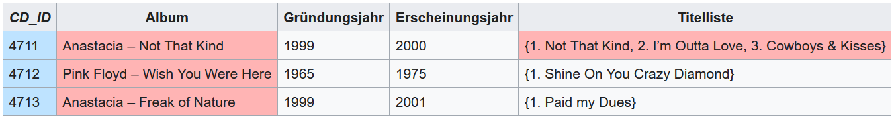
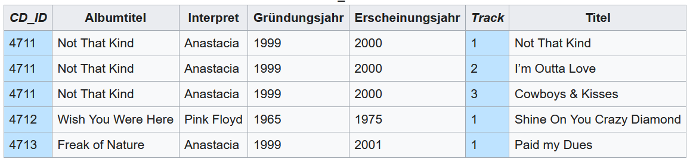
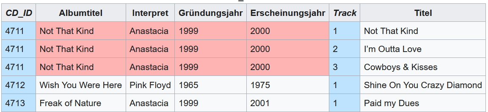
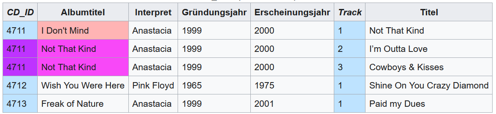
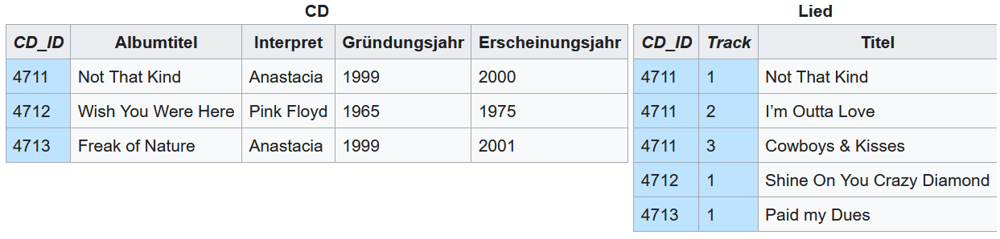
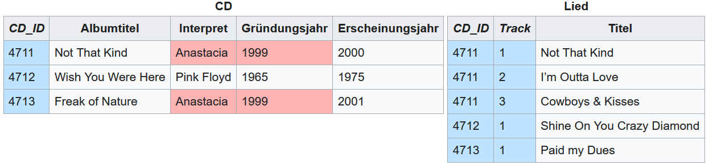
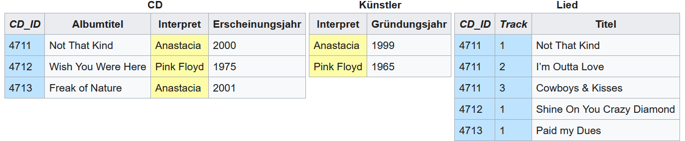
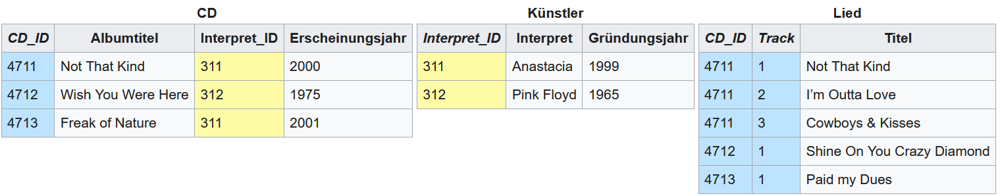

# Normalisierung

## What is it?

The process of fleshing out and cleaning up the structure of a database, based on an initial table with all the data on it.

## Starting point

Look at this table

This is our starting table. We are in state 0. The cells in red are those breaking the rules of *Normalenform 1 (NF1)*. NF1 is about atomicity: **there shall only be one value per cell**.

To clean this up, we separate the cells with two values into single cells. That's how we get to NF1.

## NF1 - Atomicity

The values that were doube have been put into single cells, by turning [Singer - Album] cells into [Singer] and [Album] cells, and separated the songs into single [Song] cells. This is NF1. There are still some problems though.

## NF2 - Monothematic

Again, in red are the problematic cells: the primary key is composed of *CD_ID* and *Track*. But the values in read are really only dependant on *CD_ID*. This means there could be a problem when trying to edit those Titles with ID 4711, since we would edit all of them. Here it is clearer:

The solution to this is taking the songs out of the main table and thus having the *Track* also be an important key.

With this, NF2 is complied. But, of course, there are still problems.

## NF3 - Transitivity

One last time, in red, the problematic cells. These still have a functional dependency among them. This means, that the *Founing year* depends on the *Band*. So, every time we initialize a new entry with a certain Band, the Founding year will be uselessly stored too. There is a simple solution to this: create another table only with these informations.

In this way, the Founding year is linked to the Band, but it is not stored needlessly.

Note that this is only a solution if the Band has a unique name worldwide. If it doesn't, create an artificial key, like an `INT` and move the Band name into a separate table as well:

## Steps to Normalisierung

1. Find all cells that are double and turn them into a single cell
2. Find all functionally dependant cells (dependant on each other) and make another table out of them
3. Find all transitive dependant cells (X depends on Y and Y depends on Z, therefore X depends on Z) and make another table out of them.
