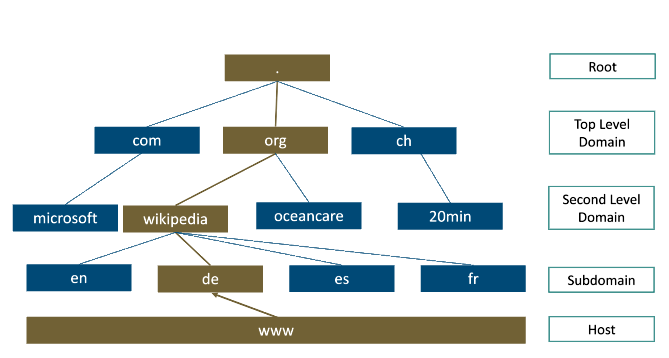
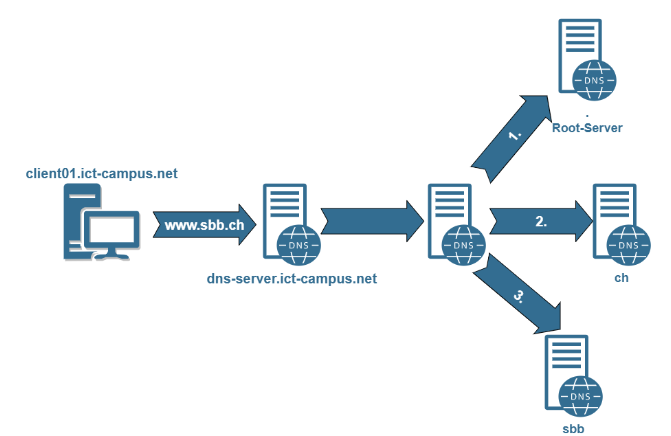
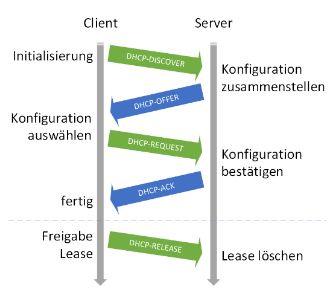

# DNS and DHCP

## Definition

DNS stands for Domain Name Service and is one of the most important services on the internet. It translates IP addresses into names and vice-versa. Example: 65.55.12.249 <--> www.microsoft.com

## Strucutre

Based on [RFC 1035](https://www.rfc-editor.org/rfc/rfc1035), DNS is a **hierarchical** database and is composed of multiple domains. These **Nameservers** manage only a small part of the entire **Namespace**. In order to get a translation, a **Resolver** on a client sends a request to the **Nameserver** and it returns an answer, if there is a matching one.

How a typical request gets resolved:

Some facts:

1. If available, a local DNS server will be used. Otherwise, public ones are available (Google: 8.8.8.8).
2. The router will use the IPS's DNS server.

## DHCP server function

It assigns an IP and the Network Mask. But it can also assign the standard gateway, DNS addresses, WINS Server addresses and others.

Process:

Beware:

- The router doesn't automatically forward on Broadcast
- multiple DHCP servers don't synchronize
- if no DCHP server is available, APIPA (Automatic Private IP Addressing) will take over.