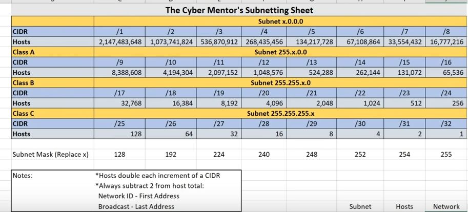

# IP-Adressing

## IP Adress

32 bit (2**32 possibilities)

## Subnetting

First adress: 255.255.x.0.
Last adress: 255.255.x.255.

## Private Adress

Used within a private network. These can not be routet through the internet. The way to get to them is via NAT (Network Adress Translation). This connects the private adress to a public one.

APIPA gives this adress, when no DHCP Client available.
