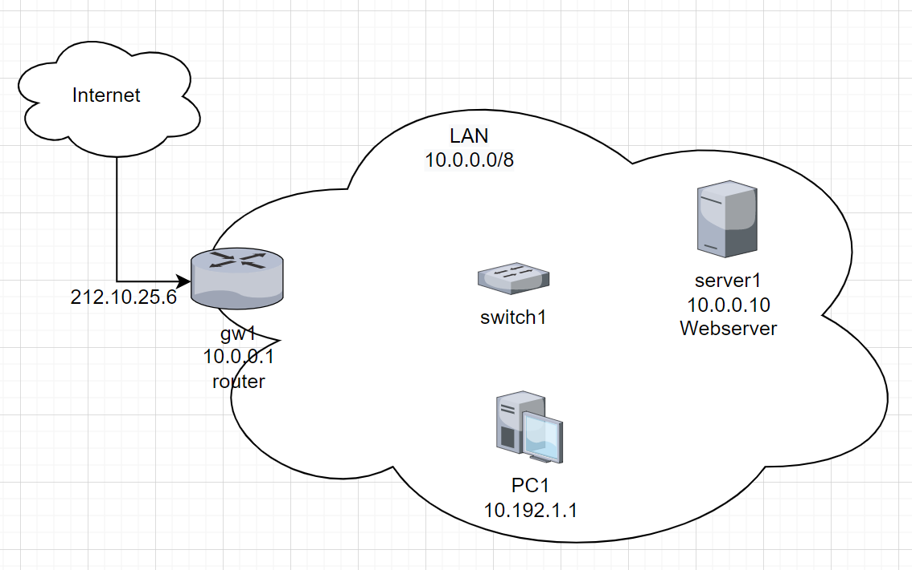

# Network plan

## What's the point

To visualize the number and position of nodes and the connections between nodes, servers and others.

## Types

Schematic:

- Technical overview
- function of a network
- connections trough symbols

Geographic:

- actual location of sockets

## What goes into it?

- Nodes/clients
- Connections
- IP-Adress, name, MAC and ports
- Encapsulation of network (with CIDR)
- Bridge, switch

