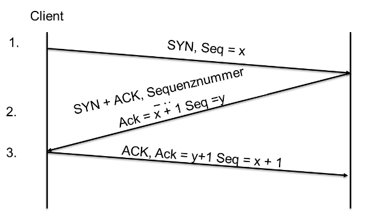
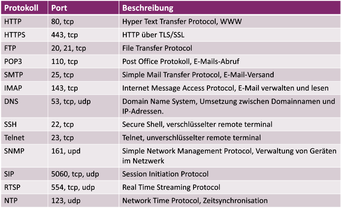

# TCP and UDP

## Uses

TCP and UDP are used to transport data within the TCP/IP protocol family. Each of these does this in a different way.

## Ports and sockets

An IP + Port make a **Socket**. These Sockets are connections on the TCP/IP layer and are used by both TCP and UDP. Most protocols or services use specific **ports**, which data is allocated to.

The port assignment is controlled by IANA (Internet Assigned Numbers Authority):

- 0 - 1023: well known ports
- 1024 - 49151: registered ports
- 49152 - 65535: dynamic and private ports

## TCP in detail

TCP stands for Transmission Control Protocol. It is focused on connections, reliability and flexibility when it comes to bandwidth.

It basically confirms a packet has reached its destination. That's why it's called connection centered and reliable.

An example: Three-way-handshake:

### TCP Header

It receives the following information (each in four bytes):

- Source and Destination port
- Sequence Number
- Acknowledgment Number
- Header length, flags and window size
- checksum and priority
- options + zeros up to 32 bit
- Data

## UDP in detail

It was developed for speed, small overhead and to reduce redundant transport protocols. Hence it is used when speed is more important than completeness and reliability, like in media streaming or phone connections.

UDP is connectionless, meaning that data is sent, but there is no guarantee nor notification of arrival.

### UDP Header

Following information in 32 bit each:

- Source and destination port
- UDP header length and checksum
- Data

## Ports

The following are some important ports to know:

