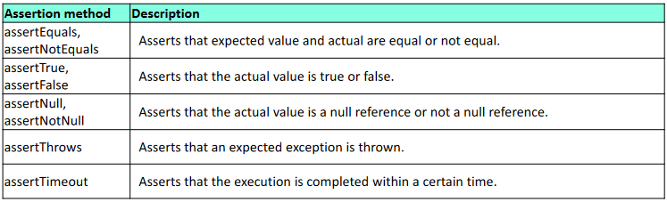

# Writing JUnit tests

## Generated test method stubs

```java
class PersonTest {
        @BeforeEach
        void setUp() throws Exception {
                ...
        }

        @Test
        void testPerson(){      // constructor test
                ...
        }

        @Test
        void testGetName(){     // test for getName()
                ...
        }
}
```

## Example test writing

```java
import kap3.Person;

class PersonTest {
        Person p1, p2, p3;

        // Initialization

        @BeforeEach
        void setUp() throws Exception {
                p1 = new Person("FN1", "LN1", 1981, 10, 15);
                p2 = new Person("FN2", "LN2", 1982, 11, 10);
                p3 = new Person("FN3", "LN3", 1983, 12, 9);
        }
}
```

## Assertions

JUnit assertions are methods provided by the framework used to verify that the **actual** results from the tested methods equal the **expected** results.



### Assertion Examples

```java
@Test
void testPerson() {
Assert.assertNotEquals(p1,
new Person("FN1", "LN1", 1981, 10, 15));
}

@Test
void testGetName() {
Assert.assertEquals("FN1" + " " + "LN1", p1.getName());
Assert.assertEquals( Math.PI, 3.141, 0.01 ); // double comparison with epsilon
}

@Test
void testGetPersonData() {
Assert.assertTrue(p3.getPersonData().startsWith("FN3"));
Assert.assertFalse(p3.getPersonData().endsWith("1"));
}

```