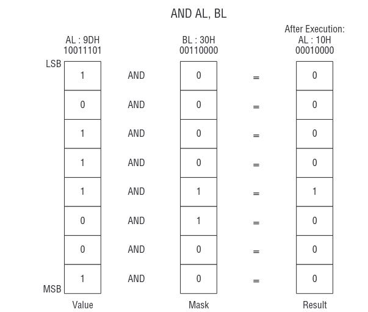

# Branching

## The Stack

**ALL THIS ALLWAYS IN LITTLE ENDIAN!**

Used to temporarily store information, like the state of a program or registers.

**LIFO** Data Structure: Last in, first out.

Ways to acces a stack:

- *Push*: add in tiem to the top
- *Pop*: remove an item from the top


### The Stack in Program Memory

It starts at a high address in program memory and grows down in direction of free memory. The other parts of a program are all stored at the "bottom" of the program's memory.

- .text section
- .data section
- -bss section

**Heap**: Programs can dynamically allocate memory for large structures. This happens on the fly, as the program runs. This allocation grows **upwards** toward the stack.

- Hopefully there is enough memory between both!


### Push instructions

(Add data on top of the stack)

Examples:

```asm
push 42             ; Push an immediate value
push ax             ; Push the ax register
; push eax          ; Not supported on x86-64!
push rax            ; Push the rax register
push word[Addr]     ; Push a word from mem at Addr
; push dword[Addr]  ; Not supported on x86-64!
push qword[Addr]    ; Push a quad word from mem at Addr
pushf               ; Push RFLAGS to stack
```

### Pop instructions

(remove data from top of the stack)

`pop` retrieves a register or memory value, `popf` retrieves the flags register.

```asm
popf                    ; Pop RFLAGS from stack
pop qword[Addr]         ; Pop a quad word to mem at Addr
; pop dword[Addr]       ; Not supported on x86-64!
pop word[Addr]          ; Pop a word to mem at Addr
pop rbx                 ; Pop to the rbx register
; pop ebx               ; Not supported on x86-64!
pop bx                  ; Pop to the bx register
```

### Stack operations with RSP

`RSP` can be used to directly address elements on the stack. The following example pushes two values onto the stack with RSP.

```asm
; Note: mov does not support copying
; 64-bit immediates directly to memory
mov r8, 0x1234567890abcdef
sub rsp, 8
mov qword [rsp], r8
sub rsp, 2
mov word [rsp], 0x1234
pop bx
pop rax
```

## `syscall`

**Provides acces to functions of the OS**
Making a System Call: `syscall`.

- On 32-but x86 , system calls were made using "int 80" (interrupt), but syscall is more efficient.
- Syscall-numbering is **different** between 32 and 64 bit!

Parameters:

- `rax`: Specifies the syscall to be invoked
- additional parameters as `rdi, rsi, rdx...`.

Return value:

- if a system call returns a value, it can be found in `rax`.

### File descriptors

Standard Input: stdin, 0
Standrad Output: stdout, 1
Standard Error: stderr, 2
Other files: A program can open more files, with `sys_open syscall`, for example. A new file descriptor is assigned to each.

Syscall example 2:

```ams
mov rax, 60 ; Code for sys_exit
mov rdi, 0 ; Return a code of zero
syscall ; Make kernel call
```

## Logical operatios

### Boolean

Work on individual bits and assume that **1 is tru** and **0 is false**.

Binary Boolean operators:

- AND (conjunction): True, if and only if both operands are true.
- OR (disjunction): True, if at least one of the ops is true.
- XOR: true, if and only if only one of the ops is true. Can be made out of AND, OR and NOT.

Unary Boolean operators:

- NOT (negation): negates the result (1 -> 0, 0 -> 1)



### Masking bits

`AND` can be used to *mask* individual bits. You prepare a *bitmask*, with a 1 for every bit we are interested in, and 0 for those we're not interested in. Then you apply `AND` on the value and bitmask. The result are the desired bits.

### Setting bits

`OR` can be used to set individual bits to 1. Again, prepare a bitmask with a 1 for every bit to set. Apply `OR`to the value and bitmask. The result can be read.

Example:

```asm
; Set bits 0 and 3 of the bytes in register AL
mov al, 0xf6
or al, 0x09 ; al is 0xff
```

### Shift instruction

(Only works with unsigned numbers!)

Syntax:

- `shl <register/memory>, count` shift left
- `shr <register/memory>, count` shift right

Shifts all the `register/memory` by `count`. This count can be an immediate value or register CL. When we do `shl`, the bits pass through a *carry flag*!

### Rotate instruction

Syntax: same as `shr`and `shl`

`rol`and `ror`: rotate bits left or right, respectively.
`rcl` and `rcr`do the same, but pass through a carry flag.

`stc`and `clc`: set or clear the carry flag, respectively.

### Divide and Multiply using shifts

It works by dividing ir multiplying by powers of two.

Why do this? Because it might be more efficient than `mul`.

Multiply 9 by 3

```asm
mov al, 0x09
shl al, 1 ; Multiply by 2
add al, 0x09 ; Add 9
```

Multiply 9 by 10

```asm
mov al, 0x09
shl al, 3 ; Multiply by 8
add al, 0x09 ; Add 9
add al, 0x09 ; Add 9
```


## Branching

Unconditional branching:

- Immediatly continue at a different address, independent of flags.
- Instruction: `jmp <Address>`

Conditional branching:

- test the value of one or more flags and jump only if the flags match the expected value. Continue normally otherwise.
  - Example: jump on zero `jz` and jump on not zero `jnz`

## Compare

Syntax: `cmp <op1>, <op2>`

Compares the two values, like a subtraction. Depending on the result, some flags are set. No values are stored!

Some other instructions:


*Note: "greater than" and "less than" are used for signed values; "above" and "below" for unsigned values*

## Addressing Modes

Effective address: the "real" address used to read or write memory.

Base addressing: a register contains the address. `mov byte [rax], 42`.

Displacement addressing: also called absolute or static addressing. Uses a symbolic address (i.e. a label). `mov [Label], rax`.

TO DO: ADD (Index x Scale) + Displacement addressing.

## Array Addressing

TO DO: finish filling from the presentation. The professor is going too fast! Presentation on asm5-branching.
